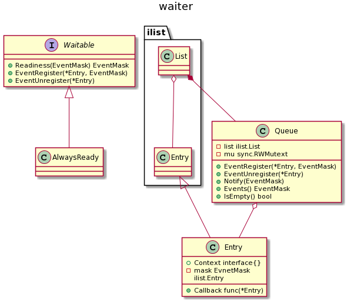

nstack [](https://travis-ci.org/caser789/nstack)
[](https://godoc.org/github.com/caser789/nstack)
[](https://goreportcard.com/report/github.com/caser789/nstack)
[](https://coveralls.io/r/caser789/nstack?branch=master)
=====

## Waiter



```
@startuml

title waiter

interface Waitable {
    +Readiness(EventMask) EventMask
    +EventRegister(*Entry, EventMask)
    +EventUnregister(*Entry)
}

class AlwaysReady {}

Waitable <|-- AlwaysReady

class ilist.Entry {}
class ilist.List {}
ilist.List o-- ilist.Entry

class Entry {
    +Context interface{}
    +Callback func(*Entry)
    -mask EvnetMask
    ilist.Entry
}
class Queue {
    -list ilist.List
    -mu sync.RWMutext
    +EventRegister(*Entry, EventMask)
    +EventUnregister(*Entry)
    +Notify(EventMask)
    +Events() EventMask
    +IsEmpty() bool
}

ilist.Entry <|-- Entry
ilist.List *-- Queue
Queue o-- Entry

@enduml
```
